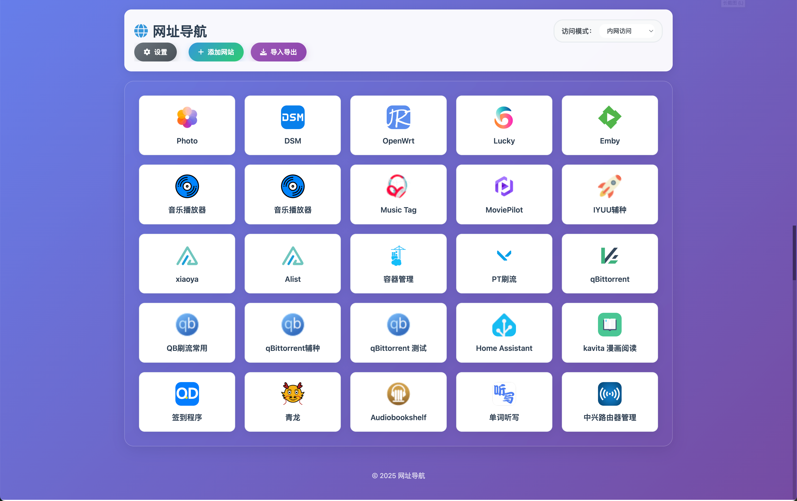

# 🚀 Sun Panel Website Navigation

[](https://hub.docker.com/r/baofen14787/sun-panel-navigation)
[](LICENSE)
[](https://nodejs.org/)

> 🎯 **A modern website navigation platform with multi-mode access support and complete website management features.**



## Method 1: 🐳 Docker Quick Deployment

```bash
# One-click deployment
docker run -d \
  --name sun-panel-navigation \
  --restart unless-stopped \
  -p 3002:3002 \
  -v $(pwd)/data:/app/data \
  -v $(pwd)/images:/app/images \
  baofen14787/sun-panel-navigation:latest
```

```bash
# Docker Compose deployment
version: '3.8'

services:
  sun-panel-navigation:
    image: baofen14787/sun-panel-navigation:latest
    container_name: sun-panel-navigation
    restart: unless-stopped
    ports:
      - "3002:3002"
    volumes:
      - ./data:/app/data  # Website data storage directory (replace with your actual directory)
      - ./images:/app/images # Website icon storage directory (replace with your actual directory)
    environment:
      - NODE_ENV=production
      - TZ=Asia/Shanghai
    healthcheck:
      test: ["CMD", "node", "-e", "require('http').get('http://localhost:3002/api/health', (res) => { process.exit(res.statusCode === 200 ? 0 : 1) })"]
      interval: 30s
      timeout: 10s
      retries: 3
      start_period: 40s

networks:
  sun-panel-network:
    driver: bridge
```

## Method 2: Traditional Deployment

```bash
# Clone repository
git clone git@github.com:hugohua/sun-panel-for-nas.git

# 1. Install dependencies
npm install

# 2. Start service
npm start

# 3. Access website
# Open browser and visit: http://localhost:3002
```

**Access URL**: http://localhost:3002

## ✨ Features

### 🚀 Core Features
- **Multi-mode Access**: Support for Intranet, IPv6, Frp, and Easytier access modes with one-click switching
- **Local Caching**: Access mode settings are automatically saved and restored on next visit
- **Real-time Search**: Support for real-time search and filtering by website name and description
- **Right-click Menu**: Support for right-click editing and deleting websites for convenient management

### 📝 Website Management
- **Add Websites**: Support for drag-and-drop upload, URL fetching, and icon retrieval
- **Icon Retrieval**: Automatically fetch website favicons with support for multiple icon selection
- **Image Upload**: Support for drag-and-drop upload and URL link image retrieval
- **IP Configuration**: Support for configuring Intranet, FRP, and Easytier IPs with automatic address filling
- **Data Persistence**: Website data and images are automatically saved locally

### 🎨 Interface Design
- **Modern UI**: Gradient backgrounds, glassmorphism effects, and rounded corners
- **Responsive Layout**: Perfect adaptation for desktop and mobile devices
- **Smooth Animations**: Smooth transition animations and hover effects
- **Default Icons**: Display first letter of website name when no icon is available
- **Optimized Popups**: Beautified scrollbars to prevent style deformation

### 🔧 Technical Features
- **Containerized Deployment**: Support for Docker and Docker Compose one-click deployment
- **RESTful API**: Complete backend API interfaces
- **Health Check**: Automatic application status monitoring
- **Secure Operation**: Non-root user operation for enhanced security

## 📖 User Guide

### Basic Operations
1. **Switch Access Mode**: Click the mode selector in the top-right corner to choose the desired access mode
2. **Access Websites**: Click any website card to access the corresponding website
3. **Search Websites**: Enter keywords in the search box to quickly find websites
4. **Right-click Management**: Right-click on website cards to edit or delete websites

### Adding Websites
1. **Open Add Window**: Click the "Add Website" button in the top-right corner
2. **Fill Basic Information**: Website name, description, and category (required)
3. **Upload Icons**:
   - **Drag and Drop**: Directly drag image files to the upload area
   - **URL Fetching**: Enter image links for automatic retrieval
   - **Icon Retrieval**: Enter website URL and click "Get Icons" button to automatically fetch favicons
4. **Configure Addresses**: Fill in URL addresses for the four access modes
5. **Save Website**: Click save to complete the addition

### Icon Retrieval Feature
- **Automatic Retrieval**: Enter website URL and the system automatically fetches favicons
- **Multiple Icon Selection**: If multiple icons are found, a selection window will pop up
- **Smart Parsing**: Support for parsing various icon tags in HTML
- **Default Icons**: Display first letter of website name when no icon is available

### IP Configuration Feature
1. **Open Settings**: Click the "Settings" button in the top-right corner
2. **Configure IPs**: Fill in IP addresses for Intranet, FRP, and Easytier
3. **Auto-fill**: When adding websites, the system will automatically fill other addresses based on the intranet address
4. **Save Settings**: Settings are automatically saved locally

### Keyboard Shortcuts
- `ESC`: Close popup or cancel operation
- `Enter`: Confirm operation

## File Structure

```
├── index.html              # Main page file
├── style.css               # Style file
├── script.js               # JavaScript functionality file
├── server.js               # Node.js server file
├── package.json            # Project configuration file
├── data/
│   └── websites.json       # Website data file
├── images/                 # Uploaded image storage directory
├── Dockerfile              # Docker image build file
├── docker-compose.yml      # Docker Compose configuration
├── .dockerignore           # Docker ignore file
└── README.md               # Documentation
```

## Data Management

### JSON Data Format
Website data is stored in the `data/websites.json` file:

```json
{
  "websites": [
    {
      "id": 1,
      "name": "Website Name",
      "image": "image_filename.png",
      "intranet": "Intranet Address",
      "ipv6": "IPv6 Address",
      "frp": "Frp Address",
      "easytier": "Easytier Address"
    }
  ],
  "categories": [
    {
      "id": 1,
      "name": "Category Name",
      "icon": "fas fa-folder",
      "color": "#3498db"
    }
  ]
}
```

### Image Management
- Uploaded images are automatically saved to the `images/` folder
- Supported formats: JPEG, PNG, GIF, WebP
- File size limit: 5MB
- Automatic unique filename generation to avoid conflicts

### Modifying Access Modes
Modify the relevant configuration in the `AccessModeManager` class in the `script.js` file:

```javascript
// Modify mode options
const modeNames = {
    'intranet': 'Intranet Access',
    'ipv6': 'IPv6 Access',
    'frp': 'Frp Access',
    'easytier': 'Easytier Access'
};
```

## 📄 License

MIT License - Free to use, modify, and distribute.

## 🌐 Language Support

- [中文文档](readme_zh.md) - Chinese documentation
- [English Documentation](README.md) - English documentation